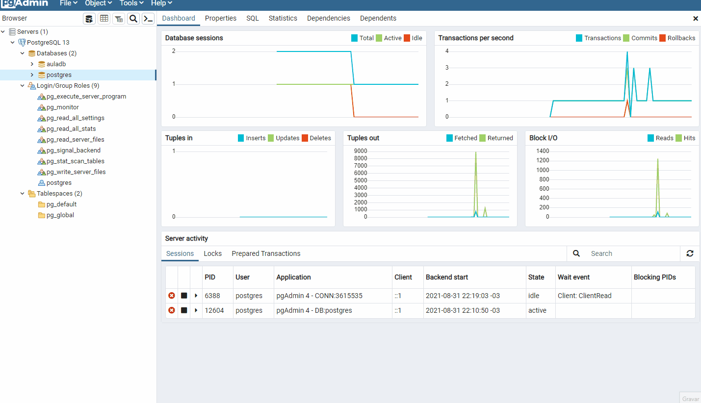

<h1 align="center">
  
   
  PostgreSQL Database Concepts and Best Practices module
</h1>

<h3 align="justify">
Instruction on changing the running pattern and creating a new database using pgAdmin4. Credit to Digital Innovation One's PostgreSQL Database Concepts and Best Practices module.
</h3>

 

## 📷 Demonstration

  
   
  

 

## 🚀 Technologies

This project was developed with the following technologies:

- PostgreSQL

 

## ⚙ Settings
- Tools
- Query Tool
- CREATE DATABASE "";
- RUN
- REFRESH
- Tools
- Query Tool
- SELECT "";
- RUN
 

---

Made with 💜 by Rafael Maciel
